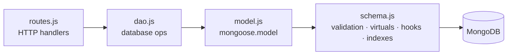
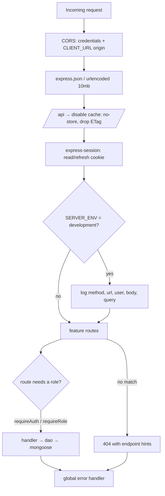
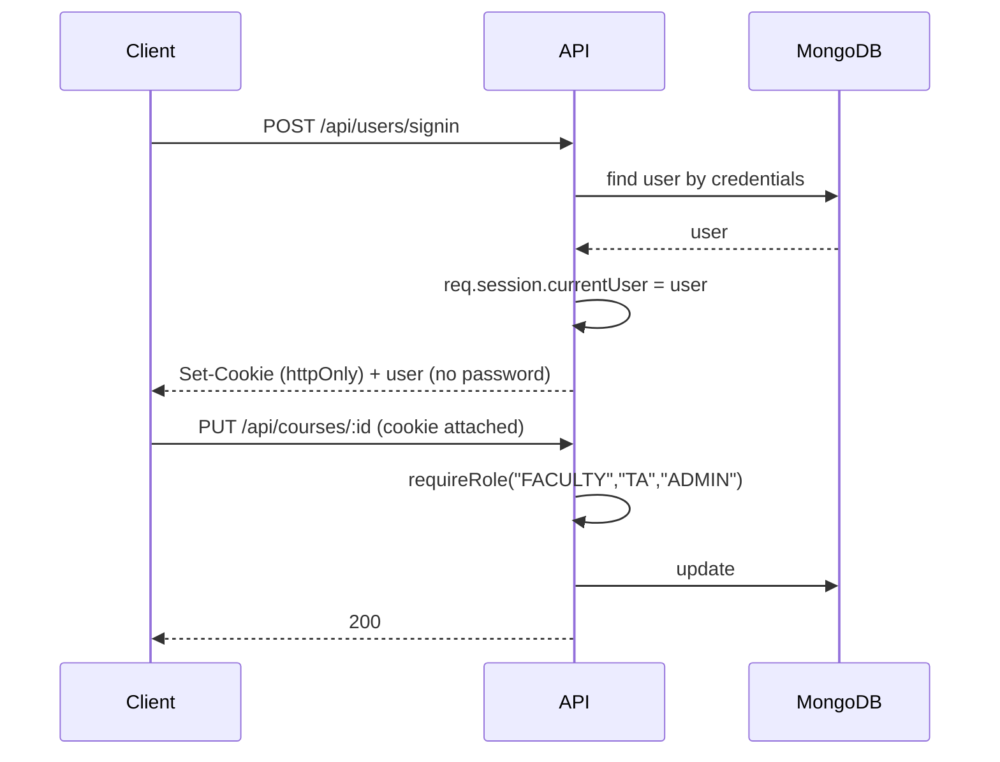
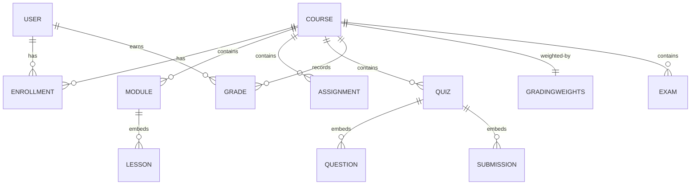

_<div align="center">


# Kambaz — Server (REST API)

**The Node/Express + MongoDB backend behind Kambaz. It's the whole API: session auth with role-based access, and full CRUD for courses, modules, assignments, a quiz engine, grades, weights, enrollments, and people — about 90 endpoints across ten feature modules.**

Runs completely free on your machine against a local MongoDB by default, and points at MongoDB Atlas + Render with one environment variable when I want it hosted.


<a href="https://kambaz-next-js-vicky-a6.vercel.app/Account/Signin"><b>▶ Live app (Vercel)</b></a> · https://kambaz-next-js-vicky-a6.vercel.app/Account/Signin


<a href="https://kambaz-node-server-app-vicky-a6.onrender.com/api/health"><b>▶ Live API health check (Render) </b></a> · https://kambaz-node-server-app-vicky-a6.onrender.com/api/health


<div align="center">


</div>

</div>

---

## About

This is the server half of my Kambaz LMS. The frontend (a separate Next.js app) never touches the database directly, it goes through this API for everything: signing in, loading a dashboard, building a quiz, grading a submission, managing a roster.

The thing I cared about most on the backend is that permissions live **here**, not in the browser. Session middleware decides who's allowed to do what, so hiding a button in the UI isn't the security boundary — the API is. Sign-in creates a server-side session, the session cookie rides along on every later request, and role checks (`requireAuth`, `requireRole`) gate anything that should be faculty- or admin-only.

It's organized so each feature is its own little stack — **routes → data-access layer → Mongoose schema → model** — which keeps files small and keeps HTTP handling, database logic, and validation from bleeding into each other. Every collection uses a `uuid` string `_id`, and the schemas do real work: length and format validation, enums, unique indexes, date-ordering checks, virtuals for computed fields, and pre/post hooks (for example, grading weights that refuse to save unless they add up to exactly 100%).

By default it connects to a local MongoDB, so it's free and offline. Swap the connection string for an Atlas URI and set `SERVER_ENV=production`, and the same code runs on Render behind secure cross-site cookies.

<div align="center">

</div>

## What's inside

- **Session auth** with `express-session` and HTTP-only cookies — signup, signin, signout, and a profile lookup, with passwords stripped out of every response.
- **Four roles** (Student, Faculty, TA, Admin) enforced by reusable middleware.
- **Ten feature modules**, each split into `routes` / `dao` / `schema` / `model`: Users, Courses, Modules, Assignments, Quizzes, Grades, GradingWeights, Enrollments, People, Exams.
- **Nine Mongoose models** with validation, compound indexes, virtuals, and save/update hooks.
- **A quiz engine on the data side** — quizzes embed their questions (multiple choice, true/false, fill-in-the-blank with per-blank points) and student submissions (attempts, per-question scoring, timing, feedback), with endpoints to submit and grade.
- **Weighted grading** — a grades collection plus a per-course weights document that's validated to total 100%, so the client can roll everything up into a final letter grade.
- **Operational bits**: `/api/health` and an admin-only `/api/stats`, dev-only request + Mongo query logging, cache headers disabled on `/api`, a 404 handler that lists the real endpoints, a global error handler, and graceful shutdown that closes the Mongo connection cleanly.

## Tech stack

- **Runtime** — Node.js (ES modules; `"type": "module"`). Built on Node 24 (Active LTS); the engine floor is Node 18+.
- **Framework** — Express 4.21
- **Database** — MongoDB 8 via Mongoose 8.19 (plus the `mongodb` 6 driver)
- **Auth / sessions** — `express-session` 1.18 with HTTP-only cookies
- **CORS** — `cors` 2.8 with credentials enabled
- **Config** — `dotenv` 17 for environment variables
- **IDs** — `uuid` 13 for string primary keys
- **Dev** — `nodemon` 3 for auto-restart on save

> Versions I checked as of **July 2026**: Node 24 is the Active LTS (26.5 is current), MongoDB Community is on 8.2, and the Mongoose 8 line is current. The `package.json` ranges resolve to these on a fresh `npm install`.

---

## Architecture

Layered, one stack per feature:



### Request lifecycle (the middleware pipeline in `index.js`)



### Auth & sessions

Sign-in verifies the user, stores `currentUser` in the session, and returns a Set-Cookie. Because the cookie is HTTP-only it can't be read by JavaScript; the browser just replays it on every subsequent call. Role-gated handlers pull the user off the session and check it.



Cookie config: 24-hour lifetime, HTTP-only, `SameSite=Lax` in development. In production (`SERVER_ENV=production`) it flips to `SameSite=None` + `Secure` + `proxy: true` and sets the cookie domain from `SERVER_URL`, so the session survives the cross-site hop from a Vercel frontend to a Render backend.

### Data model (collections)



Registered models: `UserModel`, `CourseModel`, `ModuleModel`, `AssignmentModel`, `QuizModel`, `GradeModel`, `GradingWeightsModel`, `EnrollmentModel`, `ExamModel`. Quizzes and exams share a design but live in separate collections; questions and submissions are embedded inside the quiz document.

---

## Requirements

1. **Node.js** — [LTS](https://nodejs.org/) (Node 24; anything 22+ is fine). Check with `node -v`.
2. **MongoDB** — either **Docker** ([Docker Desktop](https://www.docker.com/products/docker-desktop/), one command below) or **MongoDB Community Server 8** ([download](https://www.mongodb.com/try/download/community)).
3. **Git** — to clone.
4. **Optional GUI** — [MongoDB Compass](https://www.mongodb.com/try/download/compass) is the natural fit; DBeaver also connects to Mongo with its MongoDB driver if you already have it.


---

## Setup, step by step

### 1 — start MongoDB

Docker (one line, data persists in a named volume):

```bash
docker run -d --name kambaz-mongo -p 27017:27017 -v kambaz-data:/data/db mongo:8
```

Or start your local `mongod` service. Either way the connection string is `mongodb://127.0.0.1:27017/kambaz`.

### 2 — clone and enter the project

```bash
git clone https://github.com/vickyliuwt/kambaz-node-server-app.git
cd kambaz-node-server-app
```

### 3 — make your `.env`

The repo ignores `.env` (it should never be committed), so create it in the project root:

```bash
SERVER_ENV=development
CLIENT_URL=http://localhost:3000
DATABASE_CONNECTION_STRING=mongodb://127.0.0.1:27017/kambaz
SESSION_SECRET=change_me_to_a_long_random_string
PORT=4000
```

### 4 — install and run

```bash
npm install
npm run dev
```

`npm run dev` runs it under nodemon, so it restarts on every save. On boot it connects to MongoDB and prints every route it registers, then starts listening on port 4000. For a plain (non-watching) start, use `npm start`.

### 5 — confirm it's up

```bash
curl http://localhost:4000/hello
# → Life is good!

curl http://localhost:4000/api/health
# → JSON: database connected, session, CORS, uptime, node version
```

Open **http://localhost:4000/api/health** in a browser and you should see healthy JSON with `database.connected: true`.

> **The database starts empty.** There's no auto-seed step — you create data through the API (sign up as Faculty, then create a course, which auto-enrolls you, and add modules / assignments / quizzes from there). If you want to preload the sample data, the JSON in the frontend's `Database` folder (users, courses, quizzes, grades, etc.) maps straight onto these collections — import it with Compass or `mongoimport` into the matching collection names (`users`, `courses`, `quizzes`, ...).

## Running it again later

1. `docker start kambaz-mongo` (or make sure `mongod` is running).
2. `npm run dev`.

---

## Environment variables

| Variable | Default | What it does |
|---|---|---|
| `SERVER_ENV` | `development` | `development` turns on request + Mongo query logging; `production` switches cookies to secure + `SameSite=None` + proxy trust |
| `CLIENT_URL` | `http://localhost:3000` | The single allowed CORS origin (credentials are on) |
| `SERVER_URL` | — | The API's public URL in production; used to set the cookie domain |
| `DATABASE_CONNECTION_STRING` | `mongodb://127.0.0.1:27017/kambaz` | Local Mongo by default; swap in an Atlas URI for cloud |
| `SESSION_SECRET` | fallback string | Signs the session cookie — set a real random value |
| `PORT` | `4000` | Port the API listens on |

---

## API reference

Everything lives under `/api` (except the `/hello` and Lab5 test routes). A session cookie is required for anything that reads or writes user data; role-gated routes are called out.

**Endpoint map:** `users` · `courses` · `modules` · `assignments` · `quizzes` · `grades` · `weights` · `enrollments` · `people` · `exams` · `system`

<details open>
<summary><b>Users & auth</b></summary>

| Method | Path | Purpose |
|---|---|---|
| POST | `/api/users/signup` | Create account + start a session |
| POST | `/api/users/signin` | Sign in + start a session |
| POST | `/api/users/signout` | Destroy the session |
| POST | `/api/users/profile` | Current user from the session |
| GET | `/api/users` | List users — filter by `role`, `name`, `section` |
| POST | `/api/users` | Create a user |
| GET | `/api/users/:userId` | One user |
| PUT | `/api/users/:userId` | Update a user |
| DELETE | `/api/users/:userId` | Delete a user |
| GET | `/api/users/:userId/courses` | Courses a user is enrolled in (`current` resolves to the signed-in user) |
| GET | `/api/users/current/enrollments` | My enrollment records |
| POST | `/api/users/current/courses` | Create a course and auto-enroll me |
| GET | `/api/users/stats` | Counts by role — **admin only** |
| GET | `/api/users/active` | Recently active users (`?days=`) |

</details>

<details open>
<summary><b>Courses</b></summary>

| Method | Path | Purpose |
|---|---|---|
| GET / POST | `/api/courses` | List / create |
| PUT / DELETE | `/api/courses/:courseId` | Update / delete |
| GET | `/api/courses/search` | Search courses |
| GET | `/api/courses/departments` | Distinct departments |
| GET | `/api/courses/active` | Currently active courses |
| GET | `/api/courses/:courseId/stats` | Per-course stats |
| GET / POST | `/api/courses/:courseId/modules` | List / add modules |
| GET / POST | `/api/courses/:courseId/quizzes` | List / add quizzes |
| GET / POST | `/api/courses/:courseId/assignments` | List / add assignments |
| GET / POST | `/api/courses/:courseId/people` | Roster read / add |

</details>

<details>
<summary><b>Modules & lessons</b></summary>

| Method | Path | Purpose |
|---|---|---|
| PUT / DELETE | `/api/modules/:moduleId` | Update / delete a module |
| POST | `/api/modules/:moduleId/lessons` | Add a lesson |
| PUT / DELETE | `/api/modules/:moduleId/lessons/:lessonId` | Update / delete a lesson |

</details>

<details>
<summary><b>Assignments</b></summary>

| Method | Path | Purpose |
|---|---|---|
| GET / PUT / DELETE | `/api/assignments/:assignmentId` | One-assignment CRUD |
| GET | `/api/assignments/stats/:courseId` | Assignment stats for a course |
| GET | `/api/assignments/search/:courseId` | Search assignments in a course |

</details>

<details>
<summary><b>Quizzes</b></summary>

| Method | Path | Purpose |
|---|---|---|
| GET | `/api/courses/:courseId/quizzes` | Quizzes for a course |
| GET | `/api/quizzes/:quizId` | One quiz |
| POST / PUT / DELETE | `/api/quizzes/:quizId` | Create / update / delete |
| POST | `/api/quizzes/:quizId/questions` | Add a question |
| PUT / DELETE | `/api/quizzes/:quizId/questions/:questionId` | Update / delete a question |
| POST | `/api/quizzes/:quizId/submit` | Submit an attempt |
| GET | `/api/quizzes/:quizId/submission` | My submission |
| PUT | `/api/quizzes/:quizId/grade/:studentId` | Grade a submission |
| GET | `/api/courses/:courseId/quizzes/search` | Search quizzes |
| GET | `/api/quizzes/stats/:courseId` | Quiz stats |

</details>

<details>
<summary><b>Grades & grading weights</b></summary>

| Method | Path | Purpose |
|---|---|---|
| GET | `/api/courses/:courseId/grades` | All grades in a course |
| GET | `/api/students/:studentId/grades` | A student's grades |
| GET | `/api/students/:studentId/courses/:courseId/grades` | A student's grades in one course |
| GET | `/api/students/:studentId/assignments/:assignmentId/grade` | One grade |
| POST | `/api/grades` | Create a grade |
| PUT / DELETE | `/api/grades/:gradeId` | Update / delete a grade |
| POST | `/api/grades/bulk/assessment` | Bulk-grade one assessment |
| GET | `/api/grades/stats/course/:courseId` | Course grade stats |
| GET | `/api/grades/stats/student/:studentId` | Student grade stats |
| GET | `/api/weights` | All grading-weight docs |
| GET / PUT / DELETE | `/api/courses/:courseId/weights` | Read / set / clear a course's weights (must total 100%) |
| POST | `/api/courses/:courseId/weights/reset` | Reset weights to defaults |

</details>

<details>
<summary><b>Enrollments</b></summary>

| Method | Path | Purpose |
|---|---|---|
| GET | `/api/enrollments/course/:courseId` | Enrollments in a course |
| GET | `/api/enrollments/user/:userId` | A user's enrollments |
| POST / DELETE | `/api/enrollments/:userId/:courseId` | Enroll / unenroll |
| GET | `/api/enrollments/check/:userId/:courseId` | Is this user enrolled? |
| POST | `/api/enrollments/bulk/enroll` | Bulk enroll |
| POST | `/api/enrollments/bulk/unenroll` | Bulk unenroll |
| GET | `/api/enrollments/stats/:courseId` | Per-course enrollment stats |
| GET | `/api/enrollments/user/:userId/stats` | Per-user enrollment stats |

</details>

<details>
<summary><b>People (roster) & Exams</b></summary>

| Method | Path | Purpose |
|---|---|---|
| GET | `/api/people/available-courses` | Courses a person could be added to |
| GET / PUT / DELETE | `/api/people/:userId` | Person CRUD |
| GET | `/api/people/:userId/courses` | A person's courses |
| PUT | `/api/people/:userId/enrollments` | Replace a person's enrollments |
| POST | `/api/people/create-with-courses` | Create a user and enroll them at once |
| GET | `/api/courses/:courseId/people` | Course roster |
| GET | `/api/courses/:courseId/people/stats` | Roster stats |
| GET | `/api/courses/:courseId/people/search` | Search the roster |
| GET | `/api/courses/:courseId/exams` | Exams for a course |
| POST | `/api/exams` | Create an exam |
| PUT / DELETE | `/api/exams/:examId` | Update / delete an exam |
| GET | `/api/exams/stats/:courseId` | Exam stats |

</details>

<details>
<summary><b>System & test routes</b></summary>

| Method | Path | Purpose |
|---|---|---|
| GET | `/hello` | Sanity check → `Life is good!` |
| GET | `/` | Welcome string |
| GET | `/api/health` | DB / session / CORS / uptime status |
| GET | `/api/stats` | Collection counts — **admin only** |
| GET | `/lab5/welcome` + exercises | HTTP fundamentals labs (path params, query params, objects, arrays) |

</details>

---

## Project structure

Organized by feature, so everything about one thing lives together.

```
kambaz-node-server-app/
├── index.js                 # entry: mongo connect · cors · session · cache rules · route wiring · health · stats · error + shutdown handlers
├── Hello.js                 # /hello and / test routes
├── Kambaz/
│   ├── middleware.js        # requireAuth · requireRole · requestLogger · errorHandler · checkDatabaseConnection
│   ├── Users/               # routes · dao · schema · model   (4 roles, unique username/email, password stripped)
│   ├── Courses/             # routes · dao · schema · model
│   ├── Modules/             # routes · dao · schema · model   (lessons embedded)
│   ├── Assignments/         # routes · dao · schema · model   (Assignment/Project, upcoming/overdue statics, text search)
│   ├── Quizzes/             # routes · dao · schema · model   (embedded questions + submissions, submit + grade)
│   ├── Grades/              # routes · dao · schema · model   (percentage + letter-grade virtuals)
│   ├── GradingWeights/      # routes · dao · schema · model   (validated to total 100%)
│   ├── Enrollments/         # routes · dao · schema · model
│   ├── People/              # roster routes · dao
│   ├── RemoveExams/         # exam routes · dao · schema · model
│   └── Database/            # standalone seed data (import manually if you want it preloaded)
├── Lab5/                    # HTTP fundamentals: PathParameters · QueryParameters · WorkingWithObjects · WorkingWithArrays
├── .env                     # you create this (gitignored)
└── package.json             # scripts: start · dev
```

Every module follows the same four-file shape:

- **`routes.js`** — Express handlers; parse the request, call the DAO, shape the response.
- **`dao.js`** — all the Mongoose queries; the only place that touches the database.
- **`schema.js`** — the Mongoose schema: validation, virtuals, indexes, and pre/post hooks.
- **`model.js`** — registers the model (e.g. `mongoose.model("CourseModel", schema)`).

---

## Deploying to the cloud (optional)

Same idea as the local setup, two things change:

1. **Database → MongoDB Atlas.** Create a free cluster and set `DATABASE_CONNECTION_STRING` to its URI. Nothing else in the code changes.
2. **API → Render.** Deploy as a web service, build with `npm install`, start with `npm start`, and set the env vars — including `SERVER_ENV=production`, `CLIENT_URL` (your Vercel URL), and `SERVER_URL` (this service's own URL). The production branch of the session config then takes over: `secure` cookies, `SameSite=None`, and `proxy: true` so the cookie works across the Vercel → Render origin split.

That's exactly how the live API runs. Atlas and Render both have free tiers, so cloud mode can still be $0.

---

## When something goes wrong

- **`mongodb connection failed` on startup (process exits)** — Mongo isn't reachable. `docker ps` (or start `mongod`), confirm port 27017, and check `DATABASE_CONNECTION_STRING`. The server intentionally exits if it can't connect.
- **Client signs in but every call returns 401** — the session cookie isn't sticking. Locally, `CLIENT_URL` must be exactly `http://localhost:3000` and the client must be visiting that origin (not `127.0.0.1`). In production, `SERVER_ENV=production` has to be set so cookies are `secure` + `SameSite=None`.
- **CORS error in the browser** — `CLIENT_URL` doesn't match where the frontend actually runs. Line them up and restart.
- **`Port already in use`** — something else holds 4000; change `PORT` or stop the other process.
- **Weights won't save** — the four weights must total exactly 100%; the schema rejects anything else on purpose.
- **`403 Admin access required`** on `/api/stats` or `/api/users/stats` — those are admin-only; sign in as an Admin.
- **Fresh database** — `docker rm -f kambaz-mongo && docker volume rm kambaz-data` wipes it so you can start empty.

## What I'd harden next

Honest list of what isn't here yet:

- **Hash passwords with bcrypt** (they're compared in plaintext right now) and move to short-lived **JWTs** as an alternative to server sessions.
- **Automated tests** — Jest + Supertest around the routes and DAOs.
- **A GitHub Actions pipeline** to lint and run those tests on every push.
- **A proper seed script** (a one-command `npm run seed`) so the sample data loads without a manual import.

---

<div align="center">
<br>

<br>
<sub>built with 🐾 by Weiting (Vicky) Liu · Node · Express · MongoDB</sub>
</div>_
